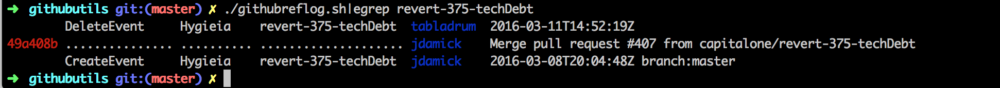
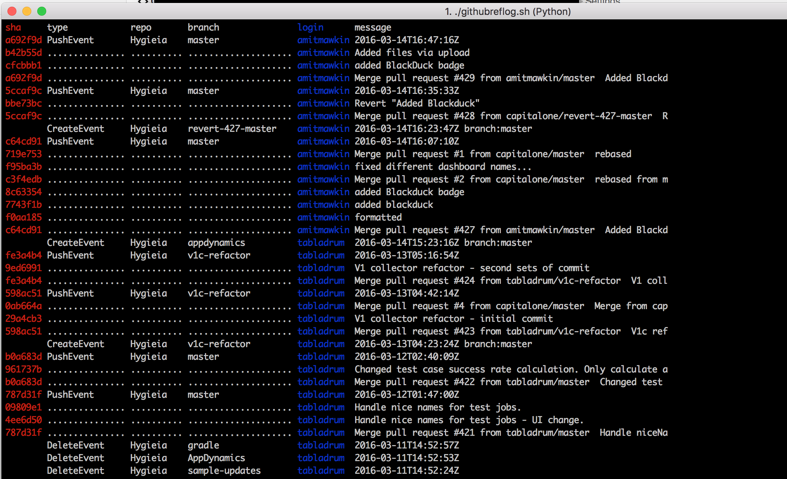

# gitreflog
Utilities to work with reflog/event history on github

##githubreflog.sh/.py
  This script creates a human readable log of actions against the repo, extremely useful in a multi person team to determine what occured.  The key driver for creating this was to make it convient to find who deleted a branch and what the sha is to recover it.
  
  

###Optional Paramaters
  -u \<github users\> - defaults to user from origin url of current directory
  
  -r \<github Repo\> - defaults to repo from origin url of current directory
  
  -f \<Filter Pattern\> - you can filter by simple text string, ie PushEvent , Create|Delete, 2fb0255, etc ...
  
  Try it out and if you have feedback please open a Issue on this project.

  
