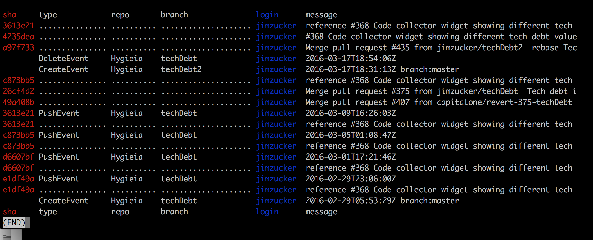

# githubutils
Utilities to work with reflog/event history on github


##githubreflog.sh/.py
  This script creates a human readable log of actions against the repo, extremely useful in a multi person team to determine what occured.  The key driver for creating this was to make it convient to find who deleted a branch and what the sha is to recover it.
  
  
  Here is the output when Filtering for 'tech' so we can see the history of who created/deleted the techdebt2 branch, I ran this on my fork of a project I work on, obviously it would be more interesting when more people are working on the branch.
  
```
  ./githubreflog.py -u jimzucker -r hygieia -f tech
```
  

  Note: You can also grep the output for patterns, if you prefer to using -f, this is a community project so the output is a bit more interesting.  You can see who created the branch and who deleted it clearly.
  

###Optional Paramaters
  -u \<github users\> - defaults to user from origin url of current directory
  
  -r \<github Repo\> - defaults to repo from origin url of current directory
  
  -f \<Filter Pattern\> - you can filter by simple text string, ie PushEvent , Create|Delete, 2fb0255, etc ...
  
  Try it out and if you have feedback please open a Issue on this project.

###To Do:
  * Impliment for local repos
